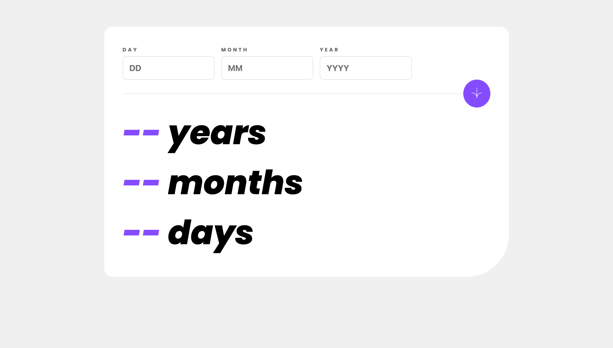

# Frontend Mentor - Solução do Age calculator app

Essa é uma solução para o [Age calculator app challenge on Frontend Mentor](https://www.frontendmentor.io/challenges/age-calculator-app-dF9DFFpj-Q). Desafios do Frontend Mentor te ajudam a melhorar suas habilidades de programação, construindo projetos realistas.

----------------------------------------------------------------------------------

This is a solution to the [Age calculator app challenge on Frontend Mentor](https://www.frontendmentor.io/challenges/age-calculator-app-dF9DFFpj-Q). Frontend Mentor challenges help you improve your coding skills by building realistic projects.

## Tabela de conteúdos

- [Geral](#geral)
  - [O desafio](#o-desafio)
  - [Screenshot](#screenshot)
  - [Links](#links)
- [Meu processo](#meu-processo)
  - [Desenvolvido com](#desenvolvido-com)
  - [O que aprendi](#o-que-aprendi)
  - [Desenvolvimento contínuo](#desenvolvimento-continuo)
  - [Recursos úteis](#recursos-uteis)
- [Autor](#autor)
- [Reconhecimentos](#reconhecimentos)

## Geral

Esse projeto é uma calculadora de idade, onde o usuário insere o dia, mês e ano de seu nascimento e recebe como resultado a quantidade de dias, meses e anos de vida.

### O desafio

Usuários devem ser capazes de:

- Ver a idade em anos, meses e dias após enviar uma data válida através do formulário
- Receber erros de validação se:
  - Qualquer campo estiver vazio quando o formulário for enviado
  - O número do dia não estiver entre 1-31
  - O número do mês não estiver entre 1-12
  - O ano estiver no futuro
  - A data for inválida, por exemplo: 31/04/1991 (há 30 dias em Abril)
- Ver o layout otimizado para a interface dependendo do tamanho da tela de seu dispositivo
- Ver os estados de hover e focus para todos os elementos interativos na página
- **Bonus**: Ver os números da idade serem animados até o número final ao enviar o formulário

### Screenshot

### Links

- Solução no Frontend Mentor: [https://www.frontendmentor.io/solutions/age-calculator-app-solution-9xlsOsFfUE](https://www.frontendmentor.io/solutions/age-calculator-app-solution-9xlsOsFfUE)
- Site: [https://marcelosarinho.github.io/frontend-mentor-age-calculator-app/](https://marcelosarinho.github.io/frontend-mentor-age-calculator-app/)

## Meu processo

No processo para fazer esse projeto, tive que procurar certas referências na documentação do MDN Web Docs e artigos.

### Desenvolvido com

- HTML5
- CSS3
- Flexbox
- CSS Grid
- Metodologia Mobile-First
- JavaScript

### O que aprendi

Nesse projeto aprendi a diferença entre as pseudo-classes CSS :focus e :focus-visible visando acessibilidade, a propriedade order do flexbox, validação de formulário usando JavaScript puro, e me aprofundei no uso do objeto Date que existe na linguagem.

### Desenvolvimento contínuo

Para o futuro, gostaria de dominar flexbox e grid completamente, em nível avançado.

### Recursos úteis

- [Focus or focus visible? A guide to make your focus state accessible](https://mayashavin.com/articles/focus-vs-focus-visible-for-accessibility) - Esse artigo me ajudou a entender a diferença entre :focus e :focus-visible, além de alguns conceitos de HTML.
- [Date - JavaScript - MDN Web Docs - Mozilla](https://developer.mozilla.org/en-US/docs/Web/JavaScript/Reference/Global_Objects/Date) - Essa documentação do MDN Web Docs me ajudou a aprofundar mais no objeto Date do JavaScript.

## Autor

- Frontend Mentor - [@marcelosarinho](https://www.frontendmentor.io/profile/yourusername)
- LinkedIn - [Marcelo Sarinho](www.linkedin.com/in/marcelo-sarinho)

## Reconhecimentos
